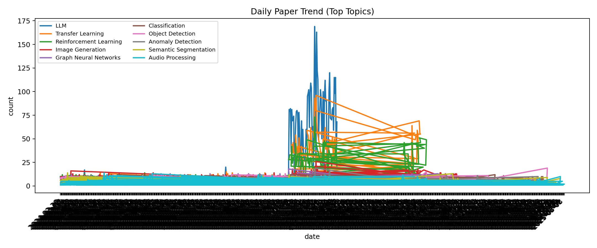
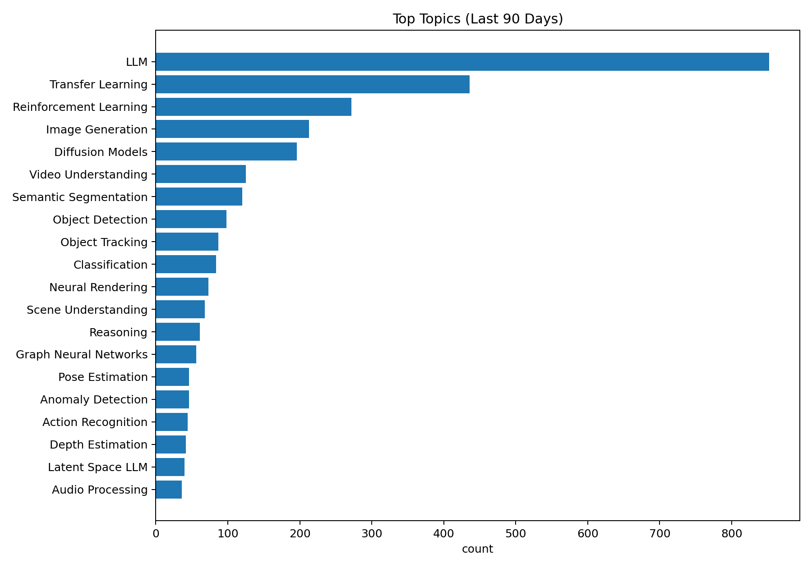
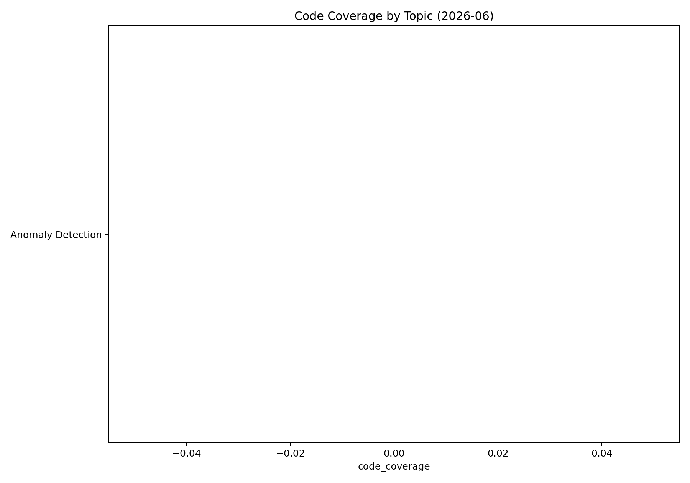
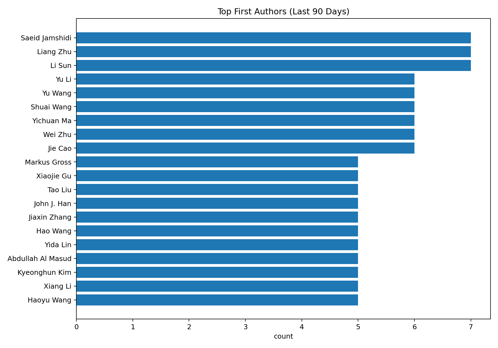

[](https://github.com/isLinXu/paper-list)<p align="center"><h1 align="center"><br><ins>Paper-List-DAILY</ins><br>Automatically Update Papers Daily in list</h1></p>
## Updated on 2026.04.07


## Introduction

This repository provides a daily-updated list of computer vision papers from arXiv, organized by topic. The updates are automated using GitHub Actions to ensure you stay current with the latest research.

Online documentation: [https://islinxu.github.io/paper-list/](https://islinxu.github.io/paper-list/)

## Analytics

- Dashboard: [analytics/](analytics/)









## Usage

To generate the paper list locally, follow these steps:

1. **Install Dependencies**
   ```bash
   pip install -r requirements.txt
   ```

2. **Run the Script**
   ```bash
   python get_paper.py
   ```

3. **Configuration**
   You can customize the search keywords and other settings in `config.yaml`.

### Advanced Usage

You can also use the scripts in the `scripts/` directory for additional tasks:

- **Count Papers in Range**: Count the number of papers within a specific date range.
  ```bash
  python scripts/count_range.py 2024-01-01 2024-12-31
  ```

## Paper List

  <ol>
    <li><a href=Classification.md>Classification</a></li>
    <li><a href=Object_Detection.md>Object Detection</a></li>
    <li><a href=Semantic_Segmentation.md>Semantic Segmentation</a></li>
    <li><a href=Object_Tracking.md>Object Tracking</a></li>
    <li><a href=Action_Recognition.md>Action Recognition</a></li>
    <li><a href=Pose_Estimation.md>Pose Estimation</a></li>
    <li><a href=Image_Generation.md>Image Generation</a></li>
    <li><a href=LLM.md>LLM</a></li>
    <li><a href=Scene_Understanding.md>Scene Understanding</a></li>
    <li><a href=Depth_Estimation.md>Depth Estimation</a></li>
    <li><a href=Audio_Processing.md>Audio Processing</a></li>
    <li><a href=Multimodal.md>Multimodal</a></li>
    <li><a href=Anomaly_Detection.md>Anomaly Detection</a></li>
    <li><a href=Transfer_Learning.md>Transfer Learning</a></li>
    <li><a href=Optical_Flow.md>Optical Flow</a></li>
    <li><a href=Reinforcement_Learning.md>Reinforcement Learning</a></li>
    <li><a href=Graph_Neural_Networks.md>Graph Neural Networks</a></li>
  </ol>
